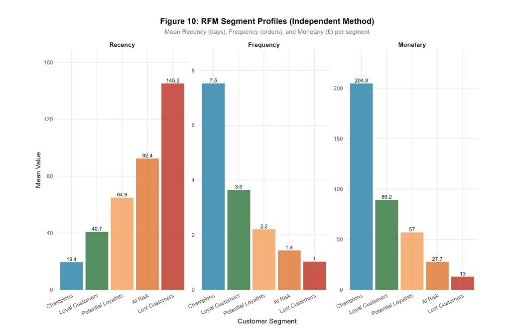
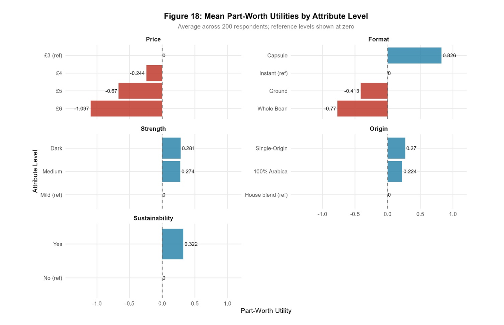
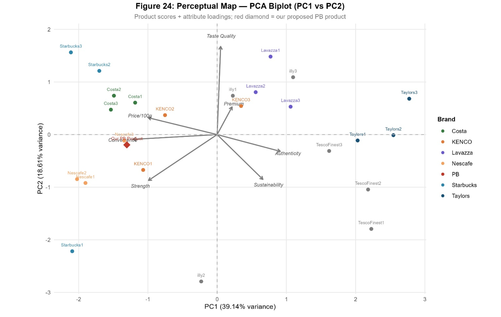

# Customer Segmentation and Product Launch Strategy: A Marketing Analytics Case

**End-to-end STP and 4P marketing strategy in R: segmenting ~920 customers, designing a product with conjoint analysis, and building an evidence-based launch plan for a private-label coffee.**

Launching a new product into a crowded category is risky and expensive. This project uses customer analytics to answer the three questions that decide whether a launch succeeds: who to target, what the product should be, and how to position and price it.

---

## Business problem

A UK grocery retailer with 922 existing customers and 5,000 prospects wants to launch a private-label coffee. Coffee is one of the most competitive grocery categories, and customers vary widely in price sensitivity, format, and taste. Picking the wrong segment or designing the wrong product would make the launch unprofitable. The task was to build a full segmentation, targeting, and positioning strategy, ending in a concrete marketing mix.

## Approach

The analysis works through the classic STP framework, backed by five analytical techniques:

- **Explore (EDA):** cleaned five source datasets, handled extreme values with Winsorisation (a 3x IQR fence) rather than deleting valid customers, and built a working base of 4,962 transactions across 922 customers.
- **Segment (RFM + clustering):** calculated Recency, Frequency, and Monetary scores, then used hierarchical and K-means clustering to group customers into meaningful segments.
- **Profile and validate (LDA):** profiled the segments demographically and used Linear Discriminant Analysis with a confusion matrix to confirm the segments were statistically distinct.
- **Design the product (conjoint analysis):** used a fractional factorial design and computed individual-level part-worths, willingness-to-pay per attribute, and attribute importance, then predicted market share across product configurations.
- **Position (PCA):** used principal component analysis to map the competitive landscape and find a viable position for the new product.
- **Tools:** R (`tidyverse`, `cluster`, `factoextra`, `MASS`, `caret`, `fmsb`, `ggcorrplot`, and others).

## Key findings

- **Loyal Customers were selected as the target segment** (n=220): a mature, higher-income group that buys frequently and represents the most defensible base for a premium private-label launch.
- **RFM clustering revealed clearly distinct behavioural segments**, validated as statistically separable by the LDA model rather than assumed.
- **Conjoint analysis quantified what the target actually values**, converting stated preferences into willingness-to-pay per attribute so the product could be designed around real trade-offs, not guesswork.
- **Market-share simulation** compared candidate product configurations, giving a data-backed basis for the final design.
- **PCA positioning** identified where the new coffee could sit in the competitive space with the least direct conflict.
- The analysis converges on a complete, evidence-based **4P marketing mix** (product, price, place, promotion) for the launch.

## Why this is relevant to operations and supply chain

Beneath the marketing framing, this is a demand-analysis and segmentation project: cleaning multi-source data, grouping a population by behaviour, validating those groups statistically, and using the result to prioritise where resources go. Segmentation, willingness-to-pay, and demand prediction map directly onto demand planning, assortment, and prioritisation problems in operations and supply chain.

## Visuals

The report contains the full set of figures. A few highlights:

*Behavioural customer segments identified through RFM and K-means clustering.*

*What the target segment values most, from conjoint part-worth analysis.*

*The competitive landscape and the new product's position, mapped with PCA.*

## Repository contents

| File | Description |
|------|-------------|
| `marketing_analytics_stp.R` | Full R pipeline: EDA, RFM, clustering, LDA, conjoint analysis, market-share prediction, and PCA |
| `Marketing_Analytics_STP_Report.pdf` | Full report: methodology, segmentation, targeting, positioning, and the recommended 4P marketing mix |
| `rfm_clusters.png` / `conjoint_importance.png` / `pca_positioning.png` | Key visuals |

## Reproducing this

Place the source CSV files in the same folder as the script (or set your own working directory at the top), then run `marketing_analytics_stp.R`. Required packages are listed at the top of the script; install any that are missing.

> *Note: the original datasets are not redistributed here as they were provided for coursework. The pipeline and code are fully reproducible with any comparable retail and survey dataset.*
